# **JENKINS - CI/CD PIPELINE HANDS-ON**


.jpg)

Jenkins is an open-source automation server that helps automate the non-human part of the software development process. It is used primarily for Continuous Integration (CI) and Continuous Deployment (CD) workflows. Jenkins allows developers to automate the building, testing, and deployment of software applications, making the development process more efficient and reliable.


# Install Jenkins on AWS Ubuntu Server


- To begin the project, I initiated the server creation process on AWS using the Ubuntu Server 20.04 LTS (HVM), SSD Volume Type AMI. I opted for a t2.micro instance type with an 8 GB volume. For security configuration, I set up a Security Group allowing SSH access on port 22 and HTTP access on port 8080. This setup provides a solid foundation for further development and deployment within the AWS.

    - AMI: Ubuntu Server 20.04 LTS (HVM), SSD Volume Type
    - Instance Type: t2.medium
    - Volume: 8 GB
    - Security Group Ports (Inbound Rules): SSH (22), custom tcp (8082) for jenkins , custom tcp (8080) for tomcat


- TCP configuration:

    - Add Rule for Port 8082: Add a new rule to allow inbound traffic on port 8082. Specify the following:

        - Type: Custom TCP Rule
        - Protocol: TCP
        - Port Range: 8082
        -Source: You can specify either a specific IP address, a range of IP addresses (CIDR notation), or leave it open to all (0.0.0.0/0 or ::/0) depending on your security requirements.


- To remotely access your Ubuntu machine using an SSH connection, you can choose your preferred tool, such as MobaXterm or VSCode. Let's start by updating all the packages


```bash
sudo apt update -y
```

- Output: 


- Java is a fundamental requirement for running Jenkins and its associated plugins, executing Jenkins Pipeline scripts, building Java applications, and integrating with Java-based tools and frameworks. Therefore, it's essential to have Java installed on an AWS Ubuntu Jenkins server to ensure the proper functioning of Jenkins and its related tasks. Let's download it as well. I will use version 11. 


```bash
sudo apt install openjdk-11-jre -y
```

- Output: 


- We will use a java source code we need maven to build so install maven

```bash
sudo apt install maven

```


- You can always check the version with ` java --version ` command.


- For jenkins you can go https://updates.jenkins-ci.org/download/war/ page to choose your version of Jenkins and copy the URL, We will use 2.387.3. It will download as a war file.

- You can always check the file is it downloaded or not with `ls` command. 

```bash
sudo wget https://updates.jenkins-ci.org/download/war/2.387.3/jenkins.war

```

- Output: 


- Following command launches Jenkins as a standalone server, making it accessible via a web browser at http://<your_ubuntu_machine_ip>:8082, where <your_ubuntu_machine_ip> is the IP address of your Ubuntu machine.


```bash
java -jar jenkins.war --httpPort=8082
```

- After running the command, it will output the autontentication token as a password. Make sure you stored that token separetly. You will need it to login into Jenkins server.  


- Go to AWS Console and connect to your ec2 instance with browser by using `Public Ipv4 address` of your ec2 instance make sure you add `:8082` at the end of your address. `http://<your_ubuntu_machine_ip>:8082`. If everything is working fine skip troubleshooting part to Jenkins Dashboard Setting -->

## Troubleshooting Jenkins Not Running 

If you've opened port 8082 on the AWS security group associated with your Ubuntu instance and you're still unable to connect to Jenkins, here are a few additional troubleshooting steps you can take:

- Check Security Group Configuration: Double-check the security group configuration to ensure that the inbound rule for port 8082 is correctly added and applied to your instance.


- Verify Jenkins is Running: Log in to your Ubuntu instance via SSH and verify that Jenkins is running. You can use the command `ps -ef | grep jenkins` to check if the Jenkins process is running.

- If you see something like following output it means that the `grep` command itself is being detected in the process list, but `there is no Jenkins process running.` This suggests that Jenkins is not currently running on your Ubuntu instance.


- To start Jenkins, you need to run the command java -jar jenkins.war --httpPort=8082 in the directory where the jenkins.war file is located. Here's how you can do it:

```bash
cd /path/to/jenkins/directory
java -jar jenkins.war --httpPort=8082
```


# Jenkins Dashboard Setting

- After successfully navigate the 8082 port, paste the password that is generated with previous command.


- Next: Install suggested plugins. 


- Next: Create an admin account.


- Next: Ready to go.


- Next: Jenkins Dashboard Landing Page.

- 


# Manage Jenkins

## Install Required Plugins for This Project

- Go to `Manage Jenkins` tab, and navigate `Manage Plugins` this is the place where actually you can download project related tools and technologies' plugins. Navifate to `Available Plugins` tab.

    

    - write `jdk` on search bar and click and install without restart following plugins;
        - `Eclipse Temurin installer`
        - `openJDK-native-plugin `

        

    - write ` owasp ` on search bar and click and install without restart following plugins;
        - `OWASP Dependency-CheckVersion 5.5.0 `  
    - write ` docker ` on search bar and click and install without restart following plugins;
        - `Docker`
        - `Docker Pipeline`
        - `docker-build-step`
        - `CloudBees Docker Build and Publish`
    - write ` sonarqube ` on search bar and click and install without restart following plugins;
        - `SonarQube Scanner `


## Global Tool Configuration

In Jenkins, the "Global Tool Configuration" section allows administrators to configure and manage global tools that can be used across all Jenkins jobs. These tools typically include build tools, version control tools, JDK installations, and other command-line utilities required for software development and build processes.

- Navigate the `Global Tool Configuration` bar on dashboard. We will configure Java, Maven, Docker and Dependency-Check.

    

    - For Java `JDK` give name as `jdk`, click `Install automatically` and choose the version of jdk. You can see in details with following; 

        

    - For Maven  give name as `maven`, click `Install automatically` and choose the version of maven. You can see in details ;

        

    - For Dependency-Check give name as `dp`, click `Install automatically` and choose the version of maven. You can see in details ;

        

    - For Docker give name as `docker`, click `Install automatically` and choose the version of maven. You can see in details ;

        


    - Save and Apply changes. 


# FreeStyle Project

- Navigate the Jenkins Dashboard, choose `create a job`.

- Give a name to your project and choose `freestyle project`.

- Scroll down to `Source Code Management` (where we configure the source code) choose `Git` go to https://github.com/jaiswaladi246/Petclinic and copy the URL of the repository. (Thank you for this project!) and paste it under the `Repository URL`. Make sure the repository branch is `main`

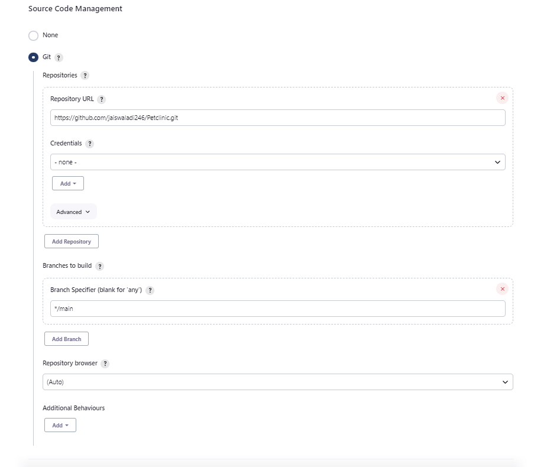


- Since this is the maven based application go to `Build Steps` and choose `Invoke top-level Maven target` tab anc choose version of maven as `maven` and goal section write `clean compile` & `clean package` like following, do not forget to add 2 build steps and configure each separetly. The reason is doing that to show you can add multiple stages into a project.


- Now scroll down and go to `Post build actions`.The "Post-build Actions" section allows you to define actions that should be performed `after the completion of a build job`. These actions typically include tasks such as `archiving artifacts`, `triggering downstream jobs`, `sending notifications`, p`ublishing reports`, and `cleaning up resources`. But for now we won't do anything. 


- The reason we see the list here is based on our plugins that we installed at the beginning. 

- Now save it and from left side bar choose `build now` to build your project. You can see the detailed logs related the project by clicking build history on `#1`. 


- As we can see the job run successfully. 


- In this project we are going to use `Tomcat` for deployment. Let's download it as well. (It is better to not interrupt previous terminal, just open new terminal to re-connect to your server with ssh connection. )


- First let's change the user from ubuntu to root with `sudo su` command and go to `/opt` file with `cd` command.

```bash
sudo su
cd /opt
```


- For detailed about download for Tomcat server please go to https://github.com/sinemozturk/Apache-Tomcat-Hands-on.git 


```bash
sudo wget https://archive.apache.org/dist/tomcat/tomcat-9/v9.0.67/bin/apache-tomcat-9.0.67.tar.gz 

```


- Extract the zip file

```bash
sudo tar -xvf apache-tomcat-9.0.67.tar.gz
```


-  Now we need to make some changes in the tomcat server to make sure Tomcat is allowing the administrative access through its web interface by adding a new user with appropriate roles to the tomcat-user.xml configuration file. Run following command to start making changes.

```bash
sudo vi tomcat-users.xml
# ---add-below-line at the end (2nd-last line)----
# <user username="admin" password="admin1234" roles="admin-gui, manager-gui"/>
```


- Now we need to create a symbolic link allows for easier access to the Tomcat startup script, enabling users to start Tomcat by simply executing startTomcat from the command line, without needing to navigate to the Tomcat installation directory.


```bash
sudo ln -s /opt/apache-tomcat-9.0.67/bin/startup.sh /usr/bin/startTomcat
```

- Now we need to create a symbolic link allows for easier access to the Tomcat shutdown script, enabling users to stop Tomcat by simply executing stopTomcat from the command line, without needing to navigate to the Tomcat installation directory.

```bash
sudo ln -s /opt/apache-tomcat-9.0.67/bin/shutdown.sh /usr/bin/stopTomcat
```

- Now we need to configure  `manager` the context.xml file with following command

```bash
sudo vi /opt/apache-tomcat-9.0.67/webapps/manager/META-INF/context.xml


#We need to comment following scripts :
# <Valve className="org.apache.catalina.valves.RemoteAddrValve"
  #       allow="127\.\d+\.\d+\.\d+|::1|0:0:0:0:0:0:0:1" />
```

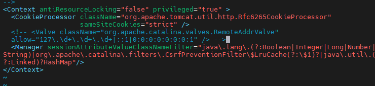

- Now we need to configure the `host-manager` in the context.xml file. This file typically contains configuration settings specific to the host-manager web application in Apache Tomcat.

```bash
sudo vi /opt/apache-tomcat-9.0.67/webapps/host-manager/META-INF/context.xml
#We need to comment following scripts :
# Valve className="org.apache.catalina.valves.RemoteAddrValve"
# allow="127\.\d+\.\d+\.\d+|::1|0:0:0:0:0:0:0:1" /> 
```

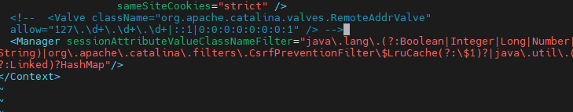


- Run separetly following commands

```bash
sudo stopTomcat
sudo startTomcat
```

- You can access the tomcat landing page with  `http://<publicIpofyourserver>:8080` do not forget to delete s from https


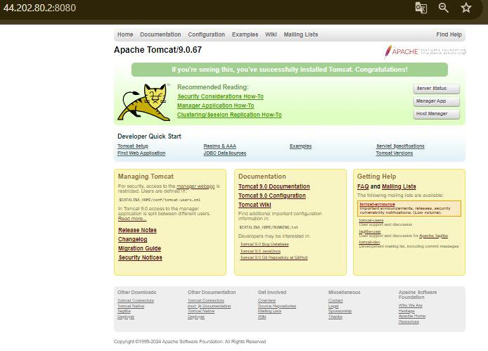


- Go back to your jenkins server and find your freestyle project from dashboard and click `configure`on the left side bar. 

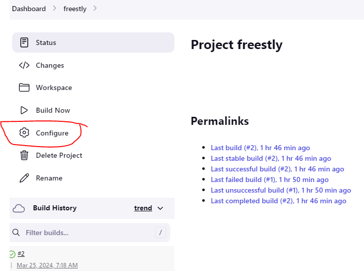


# Pipeline Project

- Go to dashboad and click `New Item` write a name for your job, and choose `Pipeline`. 

- Click `Discard old builds` write `1` to `Max # of builds to keep` 

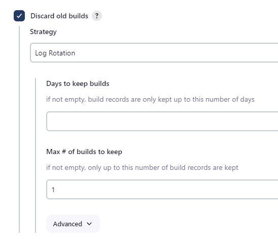

- Scroll down to `Pipeline` and choose `Execute Shell` and write following code; 


```groovy

pipeline {
    agent any

    stages {
        stage('Git Checkout') {
            steps {
                git branch: 'main', url: 'https://github.com/jaiswaladi246/Petclinic.git'
            }
        }
    }
}

```


- And apply changes and go back to pipeline and `Build Now`


- This is the output of the build. You can see in detail what it does in order.

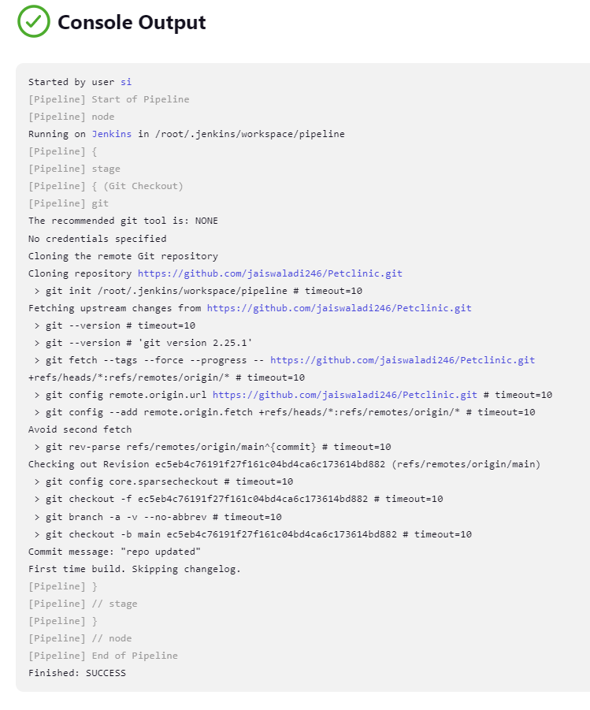

- Now we will add different stages into our pipeline to be able do this, go to `pipeline` job and on the left tab navigate to `Configure`. And follow the steps; 

- First of all we will use Maven and Java tools in the pipeline script but to be able to achieve this we need to use `tools`  directive at the beginning of our stages.


```groovy
// define the maven and java tools to be able to run their command
tools{
    jdk 'jdk11'
    maven  'maven'
}
```


- Maven Compile Stage: Add following command under the `Git Checkout ` Stage 


```groovy
        stage('Compile') {
            steps {
                sh "mvn clean compile"
            }
        }
```

- Now go back to pipeline and build the pipeline with `build now`. You will see the second stage of our pipeline is running perfectly

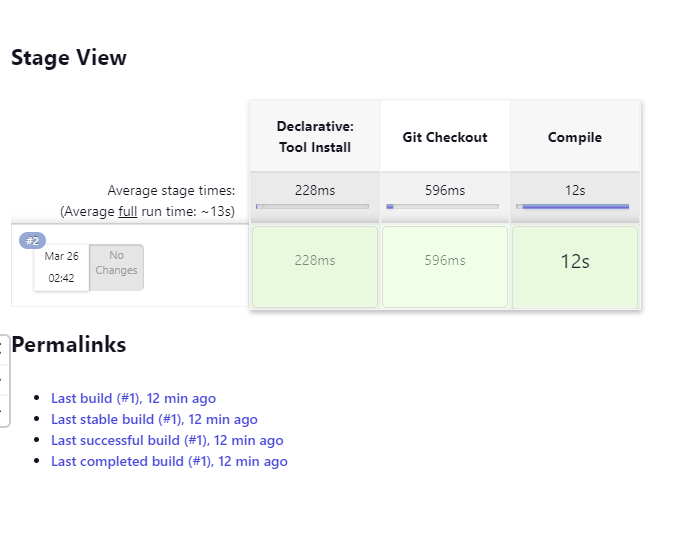


- You can alwasy go and see the logs (what this stage does?) by clicking build number and go to `console output` as you can see in the following;


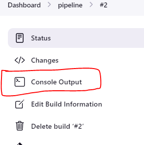

- Output will look like this;


- It appears that your Maven project is successfully compiling 47 source files to the `/root/.jenkins/workspace/pipeline/target/classes` directory. This output indicates that the compilation process is progressing as expected. After the compilation process completes, the compiled classes will be available in the target/classes directory of your Maven project.

- You can the target file see by clicking `Workspaces`

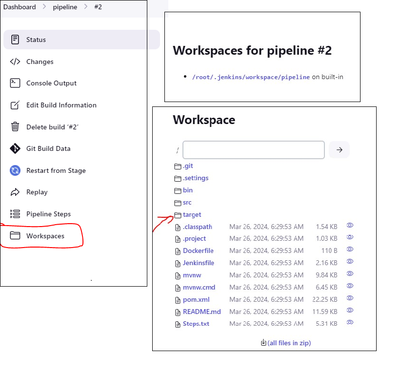


- Before we go to Maven clean Package Stage;

- Tomcat is not giving access to other users to copy the artifacts. In this part we need to change the permission of apache folder you can learn the details about apache tomcat you can go back to my previous project -> https://github.com/sinemozturk/Apache-Tomcat-Hands-on.git 


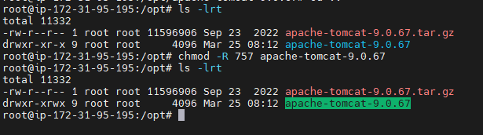

- Go and configure the pipeline by adding following stage and build it. 

```groovy
stage('Build') {
            steps {
                sh "mvn clean package"
            }
        }
```

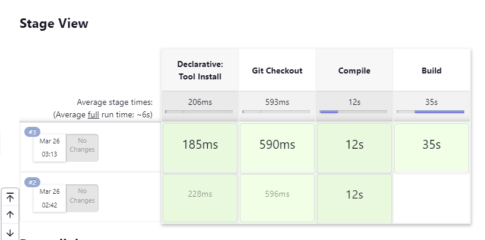    


- You can see the project's war file is being created under the target folder. We are succesfully generated the artifacts.


- Deploy the application by adding following stage to your pipeline and build it. 


```groovy
stage('Deploy') {
            steps {
                sh "sudo cp target/petclinic.war /opt/apache-tomcat-9.0.67/webapps" 
            }
        }
```

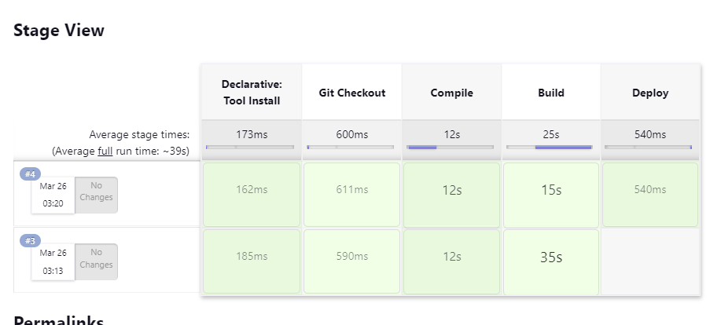


- When you go to your tomcat browser of your jenkins server `http://yourpublicipofjenkinsserver:8080/petclinic` you will be able to see the application is up and running by using jenkins pipeline. 

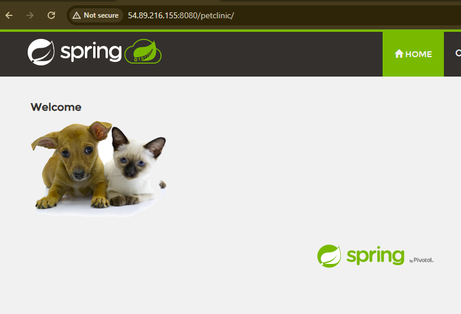
